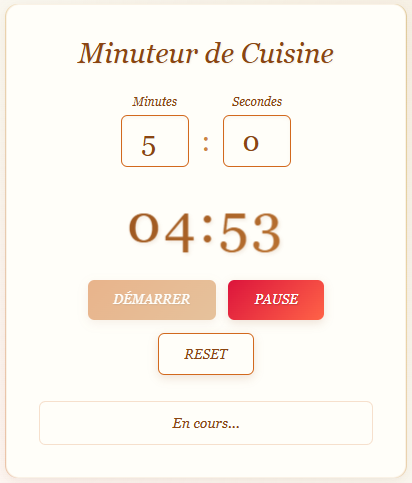

# Kitchen_Timer

## Description
Application web permettant de lancer un minuteur pour la cuisine avec sélection du temps, démarrage, pause et réinitialisation.  
Ce projet est le **vingtième** du défi personnel **100 projets en 2026**.

---

## Objectifs du projet
- Manipuler le temps en JavaScript
- Utiliser `setInterval` et `setTimeout`
- Gérer les états (start, pause, reset)
- Mettre à jour l’interface en temps réel
- Concevoir une application simple et efficace

---

## Plateforme
- Web (navigateur)

---

## Technologies utilisées
- HTML
- CSS
- JavaScript (Vanilla)

---

## Fonctionnalités
- Sélection des minutes et secondes
- Bouton Démarrer
- Bouton Pause
- Bouton Reset
- Affichage du temps restant en temps réel
- Alerte visuelle ou sonore lorsque le temps est écoulé

---

## Design & UX
- Temps affiché en grand au centre
- Boutons larges et accessibles
- Interface claire et lisible
- Contrastes adaptés pour une utilisation rapide
- Responsive (mobile et desktop)

---

## Captures d’écran

---

## Ce que j’ai appris
- Gestion des intervalles avec `setInterval`
- Conversion minutes / secondes
- Gestion d’état d’une application
- Manipulation dynamique du DOM
- Amélioration de l’expérience utilisateur avec feedback visuel

---

## Améliorations possibles
- Presets (pâtes, riz, œufs, etc.)
- Multi-timers
- Animation visuelle à la fin
- Thème sombre
- Sauvegarde du dernier temps utilisé

---

## Statut du projet
 **Projet terminé**
